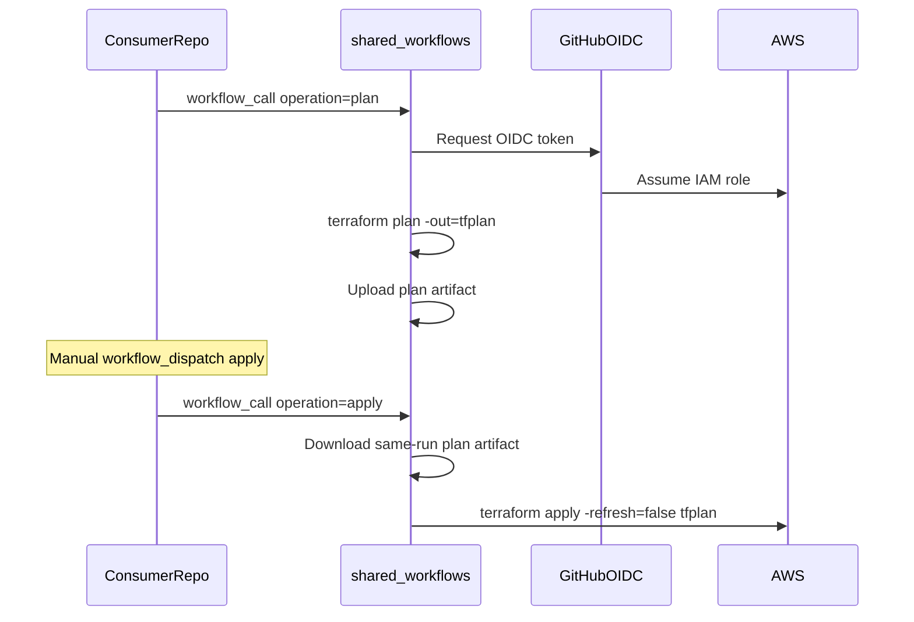

# Layer 2 — shared-workflows

Reusable GitHub Actions workflows for Terraform plan, apply, and destroy across IaC repos.

No AWS credentials are stored here. Callers pass an OIDC IAM role ARN from Layer 1 (`roles-iac`).

## Workflows

| Component | Path | Purpose |
|---|---|---|
| Composite plan action | [`actions/terraform-plan/`](actions/terraform-plan/) | fmt, init, validate, plan, upload artifact |
| Composite apply action | [`actions/terraform-apply/`](actions/terraform-apply/) | download artifact, apply saved plan |
| Legacy reusable workflows | [`.github/workflows/terraform.yml`](.github/workflows/terraform.yml) | Deprecated — OIDC must run in caller repo |

### Application CI/CD (v0.4.0+)

| Workflow / action | Purpose |
|---|---|
| [`resolve-deployment-target`](actions/resolve-deployment-target/) | Compute Lambda/bucket/API names from naming contract |
| [`build-python.yml`](.github/workflows/build-python.yml) | Test + zip Python Lambda |
| [`build-node.yml`](.github/workflows/build-node.yml) | Test + zip Node Lambda |
| [`build-java.yml`](.github/workflows/build-java.yml) | Maven test + shaded JAR |
| [`deploy-lambda.yml`](.github/workflows/deploy-lambda.yml) | Resolve targets + versioned artifact → Lambda `live` alias |
| [`deploy-ecs.yml`](.github/workflows/deploy-ecs.yml) | Docker → ECR → ECS service update |

Call from [`hello-world`](../hello-world/) app repo. Pin `@v0.4.0` for deploy-lambda (naming contract without platform prefix).

**Important:** Configure AWS OIDC credentials in the **caller repository workflow**, not inside a reusable workflow. IAM trust policies allow `singharpit2209/roles-iac`, not `shared-workflows`.

## How it works



**Plan-and-apply guarantees:**

- Apply uses the **saved plan file** from the same workflow run (`-refresh=false`)
- Apply runs in a GitHub **Environment** (`dev`) so you can require manual approval
- Destroy is **blocked** unless the caller passes `confirmation: destroy`
- All Actions are pinned to **commit SHAs**

## Setup

### 1. Push this repo to GitHub

Create public repo: `singharpit2209/shared-workflows` and push this folder.

Public is recommended so consumer repos can call workflows without extra tokens.

### 2. Configure each consumer repo

In `core-iac`, `hello-world-iac`, and `roles-iac`, add **Repository variables**:

| Variable | Value |
|---|---|
| `AWS_REGION` | `us-east-1` |
| `AWS_ROLE_ARN` | Role ARN from `roles-iac` output (`deploy_role_arns`) |

No secrets required for AWS auth.

### 3. Create GitHub Environment

In each consumer repo: **Settings → Environments → New environment → `dev`**

- Enable **Required reviewers** (add yourself) for apply/destroy approval gates

### 4. Add caller workflows

Copy examples from [`examples/`](examples/) into the consumer repo under `.github/workflows/` and adjust:

- `working_directory` — path to your Terraform root module
- `paths` filter in plan workflow — which files trigger plans
- `@main` — pin to a tag or SHA once stable (e.g. `@v1.0.0`)

## Caller examples

**Plan on pull request** — see [`examples/caller-plan-on-pr.yml`](examples/caller-plan-on-pr.yml)

**Manual apply** — see [`examples/caller-apply-manual.yml`](examples/caller-apply-manual.yml)

**Manual destroy** — see [`examples/caller-destroy-manual.yml`](examples/caller-destroy-manual.yml)

Minimal caller snippet:

```yaml
permissions:
  contents: read
  id-token: write

steps:
  - uses: actions/checkout@11bd71901bbe5b1630ceea73d27597364c9af683
  - uses: aws-actions/configure-aws-credentials@e3dd6a429d7300a6a4c196c26e071d42e0343502
    with:
      role-to-assume: ${{ vars.AWS_ROLE_ARN }}
      aws-region: us-east-1
      audience: sts.amazonaws.com
  - uses: singharpit2209/shared-workflows/actions/terraform-plan@main
    with:
      working_directory: core/dev/dns
      artifact_name: terraform-plan-dev-${{ github.run_id }}
```

## Inputs reference (`terraform.yml`)

| Input | Required | Default | Description |
|---|---|---|---|
| `operation` | yes | — | `plan` or `apply` |
| `working_directory` | yes | — | Terraform root module path |
| `aws_role_arn` | yes | — | IAM role for this repo |
| `aws_region` | no | `us-east-1` | AWS region |
| `environment` | no | `dev` | GitHub Environment for apply approval |
| `terraform_version` | no | `1.10.5` | Terraform CLI version |
| `artifact_retention_days` | no | `5` | Plan artifact retention |
| `var_file` | no | — | Path to tfvars relative to working_directory |
| `backend_config` | no | — | Backend config file relative to working_directory |

## Security notes

- Never add `AWS_ACCESS_KEY_ID` or `AWS_SECRET_ACCESS_KEY` to caller repos
- Caller workflows must set `permissions: id-token: write`
- Pin `@main` to a release tag in production use
- Plan artifacts contain infrastructure details — retention defaults to 5 days

## Next step

Push to GitHub, then build **Layer 3: modules-iac** (reusable Terraform modules).
